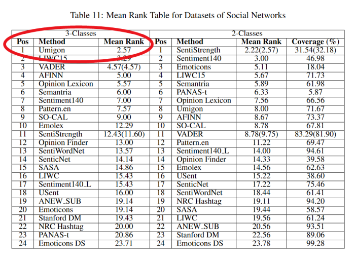
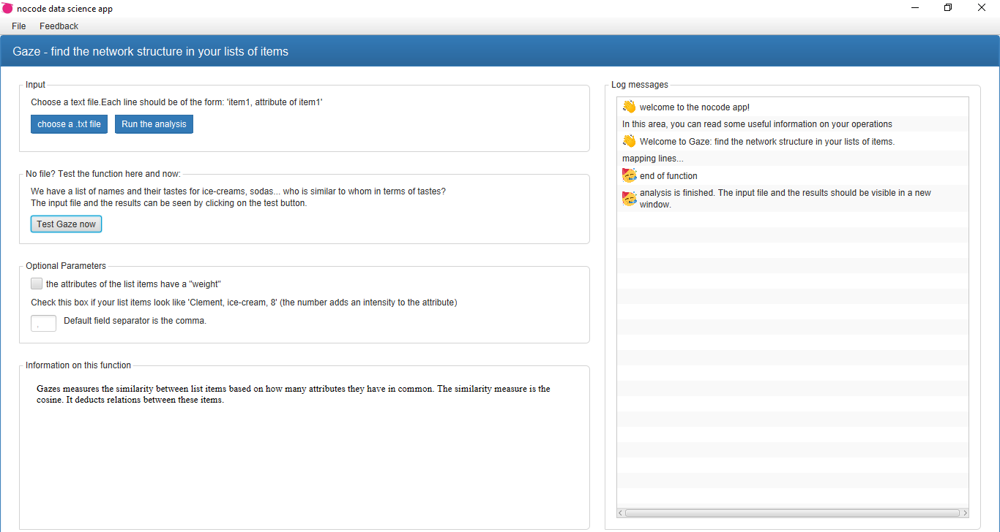
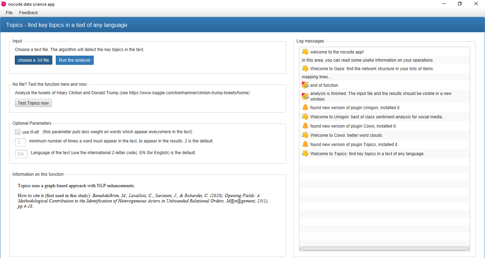
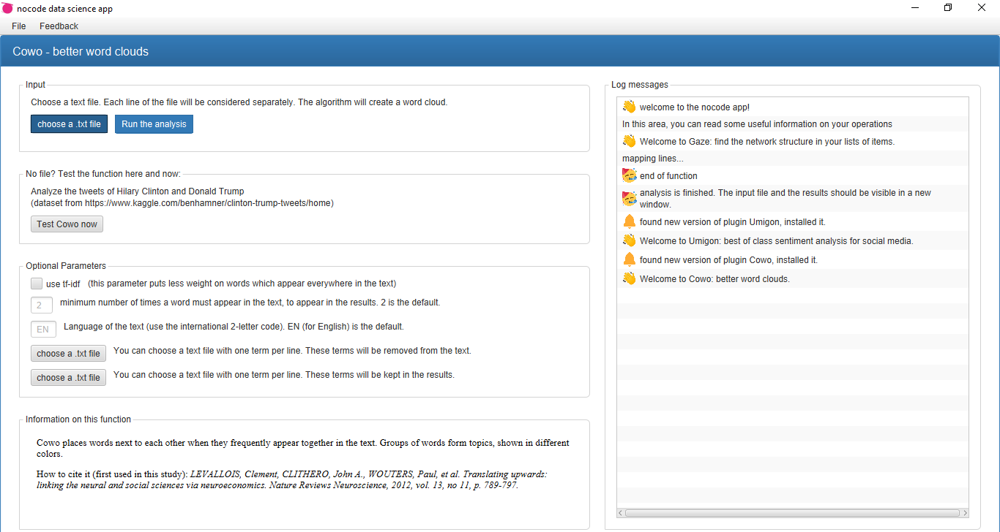
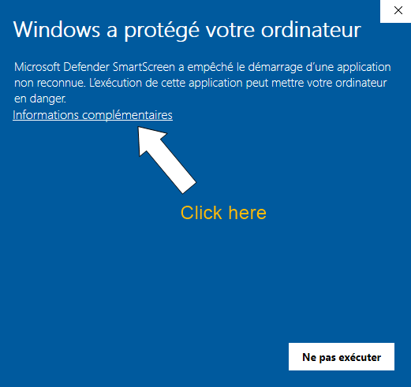
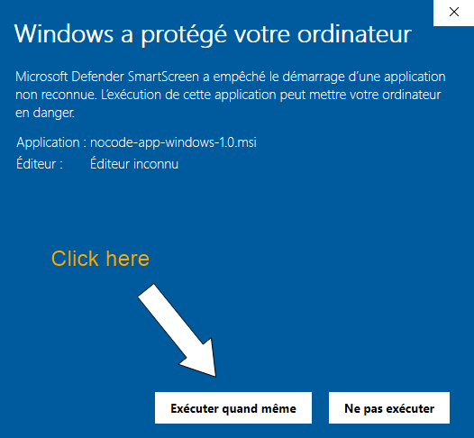

Nocodeapp: data exploration functions for analysts, students, researchers and journalists. No need to code. Free, no registration required.

[Download and install for windows](https://github.com/seinecle/nocodeapp-mods/releases/download/v.1.0.1.5/nocode-app-windows-1.0.msi)

[Download and install for linux](https://github.com/seinecle/nocodeapp-mods/releases/download/v.1.0.1.5/nocode-app-linux_1.0-1_amd64.deb)

## Use cases:

Each function asks you for a text file in input. It returns a file in output. Your input files can be small or very large - easily thousands of lines.

- Umigon: sentiment analysis for social media, in English 🇺🇸 and French 🇫🇷.
- Cowo: transform your texts into networks. 📝 -> 🕸️
- Topics: identify the key topics in texts of any language. 📰
- Gaze: find the network structure in your list of items. 🗂️ -> 🕸️

## A note on Umigon: best of its class 
[A comparative study](https://arxiv.org/abs/1512.01818) has found that out of 24 solutions, Umigon is the best performer 🏁 for sentiment analysis on social media text in English. See the table below and check [the paper behind Umigon](https://www.aclweb.org/anthology/S13-2068.pdf):

Note: "3-Classes" at the top of the left column means that the 24 solutions are judged on their performance on analyzing sentiments in three categories: positive, neutral and negative. "2-Classes" means that the solutions are tested on texts which are only positive or negative in sentiment. Umigon was released in 2012 and has been continuously updated and improved since.

## Questions / suggestions
New features? Improvements? I'll do my best to develop them. Get in touch at clementlevallois@protonmail.com or on Twitter [@seinecle](http://twitter.com/seinecle).

## The interface of the four functions:

When installing the app on Windows, you will get a warning sign as Windows is really annoying with certificates. These are the screenshots you will encounter, and where you should click:

## Acknowledgments
This app leverages these open source projects of the Java ecosystem:

- [JavaFX](https://openjfx.io/)
- [controlsfx](https://github.com/controlsfx/controlsfx/wiki/ControlsFX-Features)
- [bootstrapfx](https://github.com/kordamp/bootstrapfx)
- [Update4J](https://github.com/update4j/update4j)
- [Colt](https://dst.lbl.gov/ACSSoftware/colt/)
- [Gephi](https://gephi.org/)
- [Apache NetBeans](https://netbeans.apache.org/)
