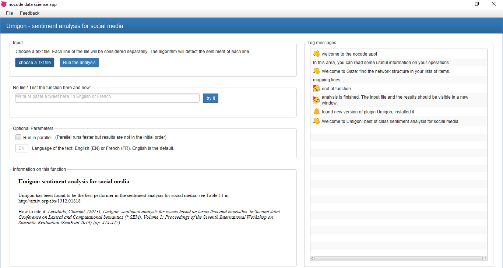

Nocodeapp: an app providing useful data exploration functions, without the need to code. Free, no registration required.

The app is available for windows and linux.

Use cases:

- Umigon: best of class sentiment analysis for social media, in English and French.
- Cowo: transform your texts into networks
- Topics: identify the key topics in texts of any language
- Gaze: find the network structure in your list of items.

**Inquiries:** clementlevallois@protonmail.com or [@seinecle](http://twitter.com/seinecle).

Below: the interface of the four functions:

When installing the app on Windows, you will get a warning sign as Windows is really annoying with certificates. These are the screenshot you will encounter, and where you should click:

